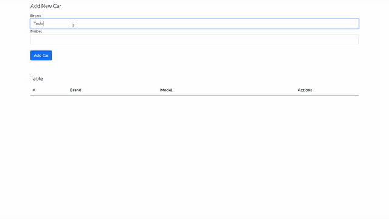

# Vue 4.5.6 + Laravel 8 + Axios Crud Application

Laravel, Vue Crud Application  

## Creating a car



## Editing the car


## Deleting the car


## Installation

1. Clone repository

2. Change to directory

```
cd vue-laravel-axios
```

3. Copy .env file


```
cp .env.example .env
```

4. Install dependencies

````
composer install
````
5. Modify `DB_*` value in `.env` with your database config.


6. Migrate
````
php artisan migrate
````

7. Install Node modules

````
npm install
````
8. Build

````
npm run prod
````

## Contributing
Pull requests are welcome. For major changes, please open an issue first to discuss what you would like to change.

Please make sure to update tests as appropriate.

